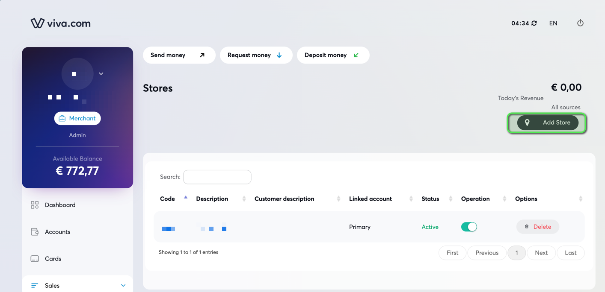
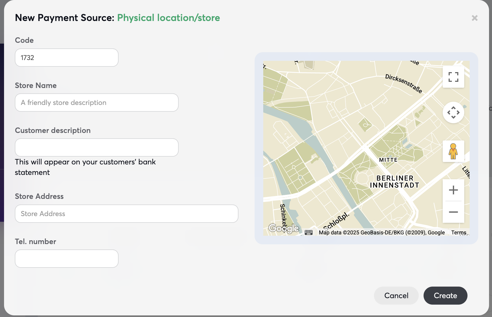
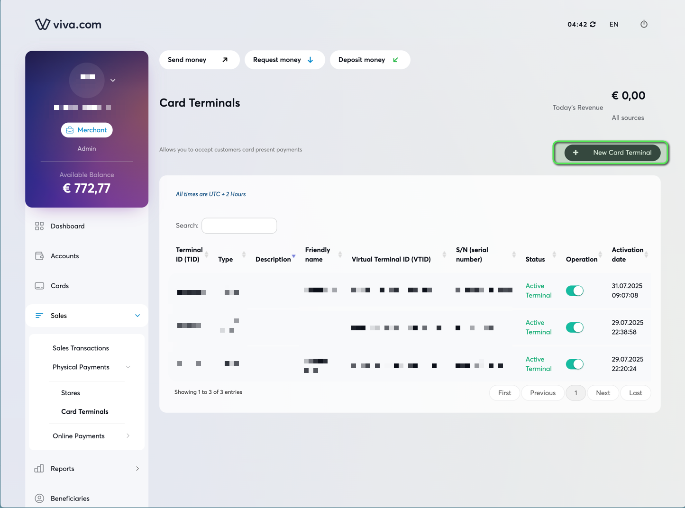
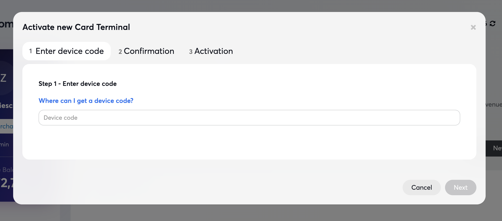
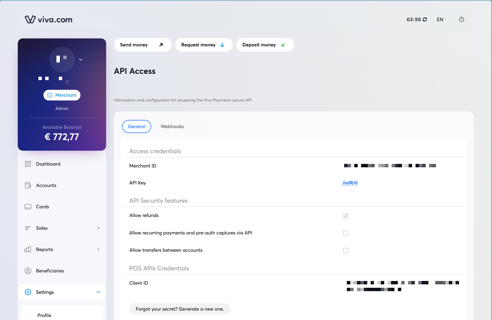
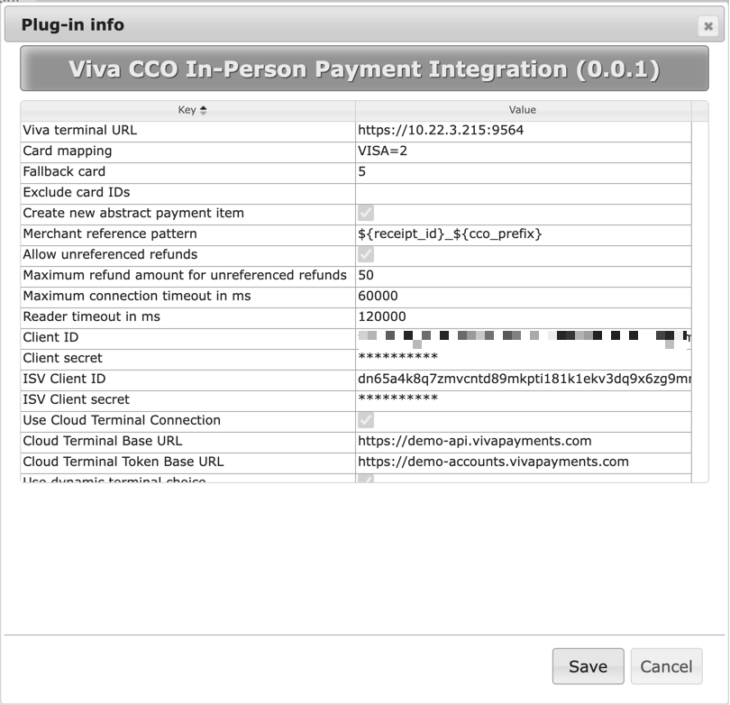
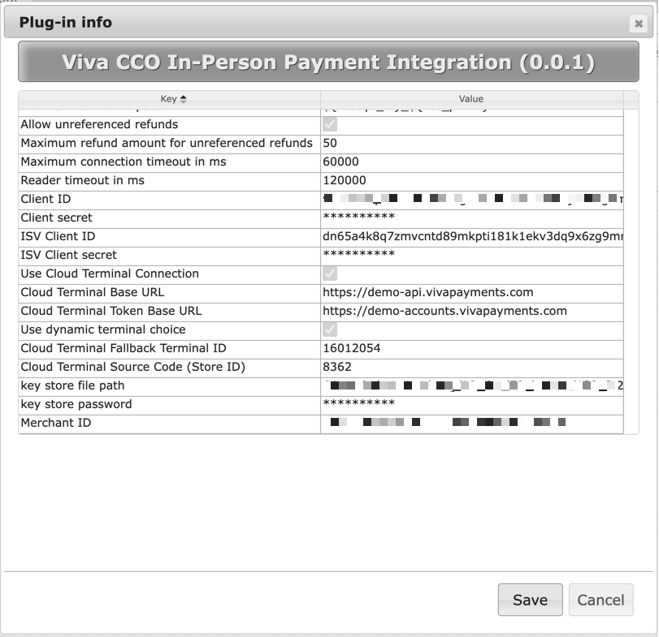

# Table of content

- [General](#general)
    - [Prerequisites](#prerequisites)
    - [Installation](#installation)
- [Configuration](#configuration)
    - [Create a store and onboard a payment terminal](#create-a-store-and-onboard-a-payment-terminal)
        - [Create a store](#create-a-store)
        - [Register a payment terminal](#register-a-payment-terminal)
        - [Create POS API Credentials / Merchant ID (only for cloud connections)](#create-pos-api-credentials--merchant-id-only-for-cloud-connections)
    - [Plugin Properties](#plugin-properties)
        - [Notes regarding the keystore file](#notes-regarding-the-key-store-file)
        - [Card Mapping](#card-mapping)
    - [Quick selection buttons](#quick-selection-buttons)
        - [Dynamic terminal choice](#dynamic-terminal-choice)
- [User flow](#user-flow)
    - [Payment](#payment)
    - [Returns](#returns)
- [ISV Configuration file](#isv-configuration-file)
- [Keystore file](#keystore-file)
    - [SSL Certificates](#ssl-certificates)
        - [Check certificate validity](#check-certificate-validity)
        - [Extracting certificates](#extracting-certificates)
        - [Importing certificates](#importing-certificates)
        - [Closing Remarks](#closing-remarks)
- [Translations](#translations)
- [Appendix](#appendix)
    - [Contact](#contact)

# General

This plugin integrates viva payment terminals with SAP Customer Checkout. The integration supports local and cloud connection.   
Because Viva's API for device lookup does not return the IP address of a terminal, dynamic terminal choice is only supported with cloud connections.    
Bluetooth is not supported.  
The protocol used for exchanging data is https. Viva payment terminals can be any android-based device with a NFC reader. You can find a list of officially supported devices on the viva website:
https://www.vivawallet.com/de_de/shop/terminals/terminals-4

## Prerequisites

This plugin was developed and tested with:

* SAP Customer Checkout FP20
* Brave Browser but all Chromium-based browsers work (Keep in mind that other CCO funcionalities require Google Chrome to work properly)
* A viva payment terminal
* A live viva account (for production use)
* A test viva account (for testing use)
* A recent Java 17 JRE (tested with SAP Machine 17.0.16—it contains some crucial root certificates that viva is using)

## Installation

Place the viva terminal integration plugin .jar file in the AP folder (usually C:\SapCustomerCheckout\cco\POSPlugins\AP).
Also place the viva_config_{CountryCode in ISO-2}.json file in the same folder.  
The json file contains country-specific configuration for the transactions. This file is mandatory and must match the country code that CCO is using.
You can look up the CCO country at Functions → Configuration → POS System → Info → Country
The file can either be obtained from our dev team or from the (to be created) ISV website.

# Configuration

The configuration of the integration is split into two parts.
First you have to configure your store(s) and terminals in the viva backend.
Secondly you need to configure the plugin in the CCO application where you want to use vivas functionality.
For the full documentation on how to use the viva backend or CCO please consult the respective documentations.

## Viva Backend - Create a store and onboard a payment terminal

### Create a store

Log into your viva merchant account and navigate to the stores section (Sales → Physical Payments → Stores)



Click on "Add Store" and enter the necessary detail in the pop-up dialog.



If cloud connection will be used, please note the "code" of the store.

### Register a payment terminal

Log into your viva merchant account and navigate to the payment terminals section (Sales → Physical Payments → Card Terminals)



Click on "New Card Terminal"



The device code will be presented on the device when you open the viva app for the first time.
After the onboarding was successful you should note down the terminal id if cloud connection to the terminal will be used.

### Create POS API Credentials / Merchant ID (only for cloud connections)

Log into your viva merchant account and navigate to the API Access section (Settings -> API Access).



**Important**: Please store the API credentials securely. You won't be able to see the Client Secret again after you close the window!

## CCO - Plugin Properties




The plugin offers the following plugin properties and can be configured in the CCO backend.

| Property                                                | Description                                                                                                                                                                                                                                                                                                                                                                                                                                                                                                                                                                                                                                                                                          |
|---------------------------------------------------------|------------------------------------------------------------------------------------------------------------------------------------------------------------------------------------------------------------------------------------------------------------------------------------------------------------------------------------------------------------------------------------------------------------------------------------------------------------------------------------------------------------------------------------------------------------------------------------------------------------------------------------------------------------------------------------------------------|
| Viva terminal URL                                       | The URL from a viva terminal (for local connections). It consists of https, the ip address and the port 9564. (https://address:9564)                                                                                                                                                                                                                                                                                                                                                                                                                                                                                                                                                                 |
| Card Mapping                                            | Used to map the credit cards in CCO to the also known as application label that the terminal sends in response <br/>e.g. VISA=2;Maestro=5 (The Credit Card Types can be found in the official VIVA Documentation)                                                                                                                                                                                                                                                                                                                                                                                                                                                                                    |
| Fallback card                                           | This card will be used after a successful payment, if the application label sent by the terminal is not found in the card mapping                                                                                                                                                                                                                                                                                                                                                                                                                                                                                                                                                                    |
| Exclude Card IDs                                        | Usually the integration will start a transaction on a terminal regardless of which CCO card is used in the PAY state. If you want to<br/> exclude some CCO cards specifically from the viva terminal, set this property accordingly. Use ; as a separator                                                                                                                                                                                                                                                                                                                                                                                                                                            |
| Create new abstract payment item                        | Whenever a payment transaction fails and this property is set to true a new payment item of the payment type "card" will be added in CCO. <br/>Also setting this property to true will show a "Retry" Button for the cashier in the payment screen after a failed payment transaction.  <br/> If you like to ask the shopper after a failed transaction, if he'd like to use another payment method (cash, gift card, ...) leave this<br/> unchecked.                                                                                                                                                                                                                                                |
| Merchant reference pattern                              | A merchant reference is sent to the terminal for each transaction and can be seen in the viva backend as well. The integration offers some  <br/> placeholders you can use to customize the merchant reference. The placeholders will be replaced with the distinct values on runtime.<br/> Use the syntax ${placeholder_key} to use a place holder. The following place holders can be used:<br/>receipt_id - the current cco receipt id <br/> cco_prefix - the cash desk ID of your CCO instance <br/> transaction_amount - the payment amount of the current payment item <br/> transaction_currency - the currency of the receipt <br/> transaction_timestamp - the timestamp of the transaction |
| Allow unreferenced refunds                              | Unreferenced refunds are refunds without an original sales receipt.  <br/>**Note**: This has to be activated by VIVA as well! XXX wo macht man das? <br/>**Note**: If you return an sales receipt in CCO and deactivate the option "Copy Payment Items" this transaction will also be handled as <br/> unreferenced refund!                                                                                                                                                                                                                                                                                                                                                                          |
| Maximum refund amount for unreferenced refunds          | Use this property to define the maximum refund amount for unreferenced refunds.                                                                                                                                                                                                                                                                                                                                                                                                                                                                                                                                                                                                                      |
| Maximum connection timeout in ms                        | Set this e.g. to 60000 for the time the integration waits to receive the response for the initial payment request                                                                                                                                                                                                                                                                                                                                                                                                                                                                                                                                                                                    |
| Reader timeout in ms                                    | The time the integration will wait for the shoppers card. A reasonable value is 120000.<br/> **Note**: The clearing time of a card is also included. Some cards in some countries may take more time to be cleared.                                                                                                                                                                                                                                                                                                                                                                                                                                                                                  |
| Client ID (mandatory for cloud)                         | The client ID when using cloud connections.    <br/> The value is shown in the section POS API credentials in your VIVA merchant account in Settings -> API Access.                                                                                                                                                                                                                                                                                                                                                                                                                                                                                                                                  |
| Client secret (mandatory for cloud)                     | The client secret when using cloud connections. The value is shown **ONCE** when you create POS API credentials.                                                                                                                                                                                                                                                                                                                                                                                                                                                                                                                                                                                     |
| ISV Client ID (mandatory)                               | The ISV Client ID. <br/> Test: dn65a4k8q7zmvcntd89mkpti181k1ekv3dq9x6zg9mr56.apps.vivapayments.com<br/> Live: ir4wk5ix06epnmk1ofm4cuass7a8v7snf8tqkejm0ppt7.apps.vivapayments.com                                                                                                                                                                                                                                                                                                                                                                                                                                                                                                                    |
| ISV Client Secret (mandatory)                           | The ISV Client secret. <br/> Test: 2xunRy9L5Ja4Wj6679nT6Ei00m2xiQ<br/> Live: d6QGY55y202s2xQf0PdW0UPAO1MoGK                                                                                                                                                                                                                                                                                                                                                                                                                                                                                                                                                                                          |
| Cloud Terminal Base URL (mandatory for cloud)           | The URL for the cloud connection.<br/> Test: https://demo-api.vivapayments.com <br/> Live: https://api.vivapayments.com                                                                                                                                                                                                                                                                                                                                                                                                                                                                                                                                                                              |
| Cloud Terminal Token Base URL (mandatory for cloud)     | The URL for authentication <br/> Test: https://demo-accounts.vivapayments.com    <br/> Live: https://accounts.vivapayments.com                                                                                                                                                                                                                                                                                                                                                                                                                                                                                                                                                                       |
| Use dynamic terminal choice (only for cloud)            | Activating this feature will retrieve all available terminals within one store. The cashier can choose dynamically which terminal to use.<br/> Or set one terminal as standard for all other future transactions. A logout will remove the choice.                                                                                                                                                                                                                                                                                                                                                                                                                                                   |
| Cloud Terminal Fallback Terminal ID (mandatory for DTC) | If for any reason the VIVA API wont return any terminals for a store, the payment transaction will be send to the fallback terminal ID.                                                                                                                                                                                                                                                                                                                                                                                                                                                                                                                                                              |
| Cloud Terminal Source Code (mandatory for DTC)          | The store id (source code) which will be used to look for available terminals.                                                                                                                                                                                                                                                                                                                                                                                                                                                                                                                                                                                                                       |
| key store file path                                     | The path to the key store file. This file will be generated automatically. It will hold all necessary SSL certificates from VIVA. Standard folder is the AP folder.                                                                                                                                                                                                                                                                                                                                                                                                                                                                                                                                  |
| key store password                                      | If generated the standard password will be "changeit". Please change the password in production use. <br/> Changing a keystore password is described here: https://docs.oracle.com/cd/E19957-01/817-3331/6miuccqo3/index.html<br/>                                                                                                                                                                                                                                                                                                                                                                                                                                                                   |
| Merchant ID                                             | The merchant ID. Can be retrieved from the VIVA merchant account in the Settings -> API Access Menu.                                                                                                                                                                                                                                                                                                                                                                                                                                                                                                                                                                                                 |
| Use Tap To Pay                                          | Activate to use the viva tap on any device feature on Android devices                                                                                                                                                                                                                                                                                                                                                                                                                                                                                                                                                                                                                                |

### Notes regarding the key store file

* Local terminal API
    * Test
        * Use the generated key store file from the plugin
    * Live
        * Use the generated key store file from the plugin
* Cloud terminal API
    * Test
        * Use the generated key store file from the plugin
    * Live
        * Use the keystore from the Java runtime environment
* Tap On Any Device feature (Tap To Pay) on Android devices
    * Test
        * Use the generated key store file from the plugin
    * Live
        * Use the generated key store file from the plugin

### Card Mapping

The following values are sent by the terminal after the payment has been completed. Please map the values to your needs.

| Card Id    | Card Description                  |
|------------|-----------------------------------|
| NET_BNCT   | BANCONTACT                        |
| NET_MASTER | Master card                       |
| NET_VISA   | Visa                              |
| NET_BNCNT  | BANCONTACT                        |
| NET_JCB    | JCB                               |
| NET_AMEX   | American Express                  |
| NET_EDND   | Edenred                           |
| NET_MNZZ   | Monizze                           |
| NET_SODX   | Sodexo                            |
| NET_DDBT   | DIRECT DEBIT                      |
| NET_PAYPAL | Paypal                            |
| NET_PAYCON | PAYCONIQ                          |
| NET_IRIS   | IRIS                              |
| NET_DINERS | DINERS                            |
| NET_KLARNA | Klarna                            |
| NET_CBNC   | CARTES BANCAIRES                  |
| NET_SNBG   | GO4MORE LOYALTY                   |
| NET_TKNIO  | TOKEN IO                          |
| NET_HOLFI  | PAY BY BANK                       |
| NET_SIBS   | SIBSPAGAMENTOS (MBway/Multibanco) |
| NET_SWISH  | SWISH                             |
| NET_TBI    | TBI                               |
| NET_AIIA   | PAY BY BANK                       |
| NET_BNCMT  | BANCOMAT PAY                      |
| NET_CNCS   | Conecs                            |
| CLK_ALPHA  | ALPHA BANK LOYALTY                |
| CLK_EBNK   | EUROBANK EPISTROFI                |
| CLK_SALPHA | ALPHA BANK LOYALTY                |
| CLK_SEBNK  | EUROBANK EPISTROFI                |
| NET_DNKRT  | Dankort                           |
| NET_CUP    | China Union Pay                   |
| NET_PBNCMT | Pago Bancomat                     |
| NET_PPRO   | PPRO                              |
| NET_CLKEBK | Cardlink Eurobank                 |
| NET_DSIBS  | SIBSPAGAMENTOS (MBway/Multibanco) |
| NET_BLIK   | BLIK                              |
| NET_SATIS  | SATISPAY                          |
| NET_BLUEC  | Bluecode                          |
| NET_ETHN   | GO4MORE LOYALTY                   |

## Quick selection buttons

### Dynamic terminal choice

When you have the dynamic terminal feature activated, you can add the following two buttons to the Quick Selection in the CCOM to let the cashier select a payment terminal. This can be done without triggering a payment transaction as
well as deleting the previous choice. Dynamic terminal choice is not available when using Tap To Pay.
Simply add a new group button at the specified space in the Quick selection and add the respective json snippets in the extended JavaScript fields:

````json
"event": {"eventName": "VIVA_ADD_STANDARD_TERMINAL_CHOICE"}
````

````json
"event": {"eventName": "VIVA_REMOVE_STANDARD_TERMINAL_CHOICE"}
````

# User flow

The integration reacts on all card payments (except the excluded cards configured in the plugin properties).  
As soon as there is no open amount left in the receipt, the plugin triggers a call to the payment terminal for each card payment.
If terminal choice was configured, the cashier can choose which terminal to use from a list of the available terminals from that location.
The chosen terminal is then used for all card payments within one receipt.  
A selected terminal can be marked "as standard". It will be the default terminal until the current user is logged out of CCO.

## Payment

The plugin uses CCOs standard payment dialog.
Split payments as well as payments with multiple different credit cards are possible.
A tipping function is enabled which allows the customer to add either predefined or custom tips to the receipt/payment.

## Returns

Returns will be done without having the need to present the card again. However, the actual refund is done asynchronously. This means the terminal response is only the
confirmation, that the refund was triggered but this can take several seconds to minutes. We do not want to let the customer wait
for so long, so please advise that the status of the refunds should be monitored frequently in the viva backend.

**REMARK:**

When returning receipts with a tip, CCO does not return the tip "salesItem". The payment, however, will be returned with the full amount. In this edge case you need to
even out the return item manually.

# ISV Configuration file

A json file will be provided per country. The plugin checks if the ISO-2 Country Code in the file name matches the country code that CCO uses. The payment handler can not be initialized, if the file is not found.
Example: e.g., viva_config_DE.json

This json file is encrypted and includes the country code as a two-tiered validation. **DO NOT** change or manipulate the file!

# Keystore file

The keystore file stores the SSL certificates from VIVA terminals as well as the certificate for the demo endpoints.

* terminal certificate: relevant in test and live environments.
* cloud terminal certificate: only relevant when using the cloud connection and test

The plugin automatically saves all certificates into the keystore file. Keep in mind, that certificates have a validity period. The plugin does **NOT** update these certificates automatically.  
The following steps will guide you through the process of updating certificates if necessary.

To configure the path to the Java Keystore use the plugin property file.
For testing purposes you can use the Java Keystore that is automatically generated by the plugin.
For production use you **must** always use the internal Java Keystore. Usually it can be found at $JAVA_HOME/lib/security/ in the cacerts file.

## SSL Certificates

For communication with the VIVA endpoints and terminals a SSL certificate chain is required. Default Java does not accept self-signed certificates or SSL certificates for IP-based Hosts like the local VIVA terminal.  
In most cases, the necessary root certificates are already included in recent Java runtimes. If the certificate is missing or outdated, you will see an exception in the CCO console.  
For example:

````shell
javax.net.ssl.SSLHandshakeException: 
    sun.security.validator.ValidatorException: PKIX path building failed: 
    sun.security.provider.certpath.SunCertPathBuilderException: 
        unable to find valid certification path to requested target
````

### Check certificate validity

Before extracting and importing certificates, you may want to check the validity period. This helps to know when certificates in the keystore must be renewed and plan accordingly.

#### Using OpenSSL (command line)

Bash / macOS / Linux:

````shell
# Check certificate validity for the demo API
openssl s_client -connect demo-api.vivapayments.com:443 </dev/null 2>/dev/null | openssl x509 -noout -dates

# Check certificate validity for a local terminal
openssl s_client -connect 10.13.37.10:9564 </dev/null 2>/dev/null | openssl x509 -noout -dates
````

Windows PowerShell:

Note that OpenSSL is not installed by default in Windows. Please consult google for instructions on how to install OpenSSL on Windows.

````powershell
# Check certificate validity for the demo API
openssl s_client -connect demo-api.vivapayments.com:443 | openssl x509 -noout -dates

# Check certificate validity for a local terminal
openssl s_client -connect 10.13.37.10:9564 | openssl x509 -noout -dates
````

Change the example IP address (10.13.37.10) to the IP address of your local terminal.

Example output:

```shell
notBefore=Jun  5 00:00:00 2024 GMT
notAfter=Aug 12 23:59:59 2026 GMT
```

**Note:** Make sure to renew and re-import certificates **before** the expiry date, otherwise communication with Viva endpoints will fail.

### Extracting certificates

Certificates can be retrieved either from a Viva Cloud endpoint (e.g. https://demo-api.vivapayments.com) or directly from a local terminal (e.g. https://10.13.137.10:9564).

#### Using OpenSSL (command line)

Bash / macOS / Linux:

````shell
# Retrieve the certificate chain from the demo API
openssl s_client -showcerts -connect demo-api.vivapayments.com:443 </dev/null

# Retrieve the certificate chain from a local terminal
openssl s_client -showcerts -connect 10.13.37.10:9564 </dev/null
````

Windows PowerShell:

Note that OpenSSL is not installed by default in Windows. Please consult google for instructions on how to install OpenSSL on Windows.

````powershell
# Retrieve the certificate chain from the demo API
openssl s_client -showcerts -connect demo-api.vivapayments.com:443

# Retrieve the certificate chain from a local terminal
openssl s_client -showcerts -connect 10.13.37.10:9564
````

Each certificate in the output starts with
-----BEGIN CERTIFICATE-----
and ends with
-----END CERTIFICATE-----

Save every certificate as a separate file, e.g., root.pem, intermediate.pem, and device.pem.

### Importing certificates

The plugin does not use the system-wide keystore (cacerts) to prevent issues when updating the JRE and overwriting existing certificates.   
Instead, the plugin uses the keystore file located in the plugin's installation directory. (Usually the AP folder in the CCO application folder)

#### Windows

````powershell
# Import root certificate into the plugin-specific keystore
keytool -import -alias viva-root -file root.pem -keystore "C:\SAPCustomerCheckout\cco\POSPlugin\AP\viva-certs.jks"
keytool -import -alias viva-intermediate -file intermediate.pem -keystore "C:\SAPCustomerCheckout\cco\POSPlugin\AP\viva-certs.jks"
keytool -import -alias viva-device -file device.pem -keystore "C:\SAPCustomerCheckout\cco\POSPlugin\AP\viva-certs.jks"
````

Change the file name and paths according to your setup. The default password for the keystore is "changeit" unless changed.
Aliases can be chosen according to your needs.

#### macOS / Linux

````bash
# Import root certificate into the plugin-specific keystore
keytool -import -alias viva-root -file root.pem -keystore /opt/sap/cco/POSPlugin/AP/viva-certs.jks
keytool -import -alias viva-intermediate -file intermediate.pem -keystore /opt/sap/cco/POSPlugin/AP/viva-certs.jks
keytool -import -alias viva-device -file device.pem -keystore /opt/sap/cco/POSPlugin/AP/viva-certs.jks
````

Change the file name and paths according to your setup. The default password for the keystore is "changeit" unless changed.
Aliases can be chosen according to your needs.

### Closing Remarks

There are also GUI-based tools available to perform the same tasks without the command line. For example "Keystore Explorer" can be used to open java keystore files, import certificates via drag&drop,  
change the keystore password, and save the updated keystore.  
Please refer to the documentation of the respective tool for detailed usage instructions.

# Translations

The translations are deployed automatically in the plugin translations folder. (usually the POSPlugins Folder in the CCO application folder)

# Appendix

## Contact

Interested in integrating VIVA Payments into your SAP CCO POS? Contact us at [cco-onboarding@viva.com](mailto:cco-onboarding@viva.com?subject=CCO%3A%20Onboarding%20Request) for more information.

Found bugs? Please report them at [support@cco-support.com](mailto:support@cco-support.com?subject=VIVA%3ASupport%20Request).